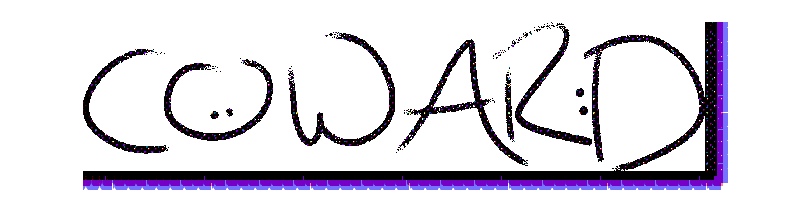

Coward is a Deno module for easy interaction with the [Discord API](https://discordapp.com/developers/docs/intro "Discord API")

## Usage

```typescript
import { Coward } from "https://deno.land/x/coward/mod.ts";
```
Please don't use this in anything important yet. It is barely functional, and as such is not production ready.
Read the [Docs](https://doc.deno.land/https/deno.land/x/coward/mod.ts)

## Ping-Pong Example

```typescript
import { Coward } from "https://deno.land/x/coward/mod.ts";

let client = new Coward("TOKEN_GO_HERE")

client.on("messageCreate", (message: any) => {
    if(message.content == "!ping") {
        client.postMessage(message.channel.id, "Pong!");
    }
})

client.connect();
```

## License

Please refer to [LICENSE](LICENSE)
